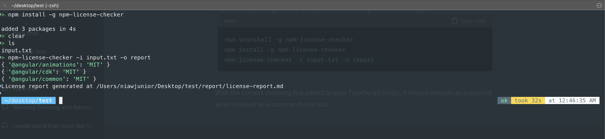
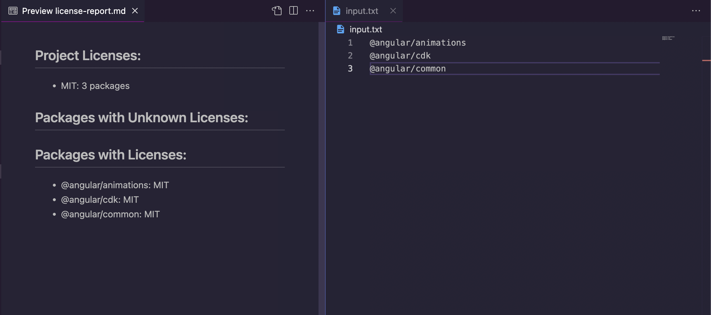

[](https://badge.fury.io/js/npm-license-checker)
[](https://www.typescriptlang.org/)
[](https://github.com/niawjunior/npm-license-checker)

# npm-license-checker

`npm-license-checker` is a lightweight and easy-to-use command-line tool for checking and displaying the licenses of npm packages. It can read package names from either a text file or directly from your project's `package.json`.

## Features

- List licenses of npm packages
- Support for both local and global packages
- Generate markdown report
- Check for outdated packages with `--outdated` flag
- Get detailed package information with `--detailed` flag including:
  - Package metadata (version, description, author)
  - Repository and issue tracking links
  - Dependencies (regular, dev, and peer)
  - Compatibility information
  - And more!

## Local Development

### Prerequisites

- Node.js v16 or higher
- npm v7 or higher

### Setup

1. Clone the repository:

   ```bash
   git clone https://github.com/niawjunior/npm-license-checker.git
   cd npm-license-checker
   ```

2. Install dependencies:

   ```bash
   npm install
   ```

3. Build the project:
   ```bash
   npm run build
   ```

### Development Commands

- `npm run dev` - Run the tool in development mode
- `npm run build` - Compile TypeScript to JavaScript
- `npm test` - Run tests
- `npm run lint` - Run ESLint
- `npm run format` - Format code with Prettier

### Testing

# Test specific features

```bash
npm run dev -- --outdated -o test-output
```

## Installation

You can install `npm-license-checker` globally using npm:

```bash
npm install -g npm-license-checker
```

Or use it directly with `npx`:

```bash
npx npm-license-checker
```

## Usage

```bash
npx npm-license-checker [options]

Options:
  -i, --input <file>    Path to file containing list of packages (one per line)
  -o, --output <dir>    Output directory for the report (default: license-report)
  --outdated            Check for outdated packages
  -d, --detailed        Show detailed information for each package
  -h, --help            Display help
```

## Example Output

### Basic Output

```markdown
# Dependency License Report

## Summary

### License Distribution

- **MIT**: 12 packages
- **Apache-2.0**: 1 package

## Packages with Licenses

- **express**: MIT (4.18.2)
- **chalk**: MIT (5.0.1)
- **lodash**: MIT (4.17.21)

## Missing License Information

No packages with missing license information

## Outdated Dependencies

The following packages have newer versions available:

- **express**: 4.18.2 → 5.0.0 (wanted: 4.18.2)
- **chalk**: 4.1.2 → 5.3.0 (wanted: 4.1.2)

To update, run: `npm update`

## Potential Version Conflicts

- **example-package**: 1.0.0, 2.0.0

> Generated at: 2023-04-01T12:00:00.000Z
```

### Detailed Package Information (with `--detailed` flag)

When using the `--detailed` or `-d` flag, the report will include comprehensive information about each package:

```markdown
## Detailed Package Information

### express@4.18.2

**License:** MIT  
**Description:** Fast, unopinionated, minimalist web framework  
**Author:** TJ Holowaychuk <tj@vision-media.ca>  
**Homepage:** http://expressjs.com/  
**Repository:** git+https://github.com/expressjs/express.git  
**Bugs:** https://github.com/expressjs/express/issues  
**Main File:** lib/express.js  
**TypeScript Types:** @types/express  
**Deprecated:** No  
**Dependencies:**

- accepts: ~1.3.8
- array-flatten: 1.1.1
- ...  
  **Dev Dependencies:**
- after: 0.8.2
- cookie-signature: 1.0.6
- ...  
  **Peer Dependencies:**
- node: >= 0.10.0  
  **Keywords:** express, framework, sinatra, web, rest, restful, router, app, api  
  **NPM Version:** 9.6.6  
  **Node Version Required:** >= 0.10.0

---

### chalk@5.0.1

**License:** MIT  
**Description:** Terminal string styling done right  
**Author:** Sindre Sorhus <sindresorhus@gmail.com>  
**Homepage:** https://github.com/chalk/chalk#readme  
**Repository:** github:chalk/chalk  
**Bugs:** https://github.com/chalk/chalk/issues  
**Main File:** source/index.js  
**TypeScript Types:** @types/chalk  
**Deprecated:** No  
**Dependencies:**

- ansi-styles: ^5.0.0
- supports-color: ^7.2.0  
  **Dev Dependencies:**
- ava: ^3.15.0
- import-fresh: ^3.2.1
- ...  
  **Peer Dependencies:**
- node: ^12.17.0 || ^14.13 || >=16.0.0  
  **Keywords:** color, colour, colors, terminal, console, cli, string, str, ansi, style, styles, formatting, rgb, 256, chalk, shell, xterm, log, logging, command-line, text, tty, format, output, styling  
  **NPM Version:** 9.6.5  
  **Node Version Required:** ^12.17.0 || ^14.13 || >=16.0.0
```

## Version History

### v1.1.0

- Added support for reading dependencies from `package.json` by default
- Improved command-line interface
- Better error handling and reporting

```



```
